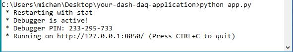

# Dash-DAQ-Omega-PID

## Introduction
An application to control the [CN32PT-440-DC Omega PID Controller](https://www.omega.ca/pptst_eng/CNPT_SERIES.html)! [Play with the demo](https://dash-daq-omega-pid.herokuapp.com/) and learn more about this application from our [blog entry](https://www.dashdaq.io/operate-an-omega-cn32pt-440-dc-pid-controller-in-python). 

### Propotional, Integral, Derivative Gain Controller (PID Controller)
PID controllers are widely used in closed loop control systems. A closed loop control system has an input that is reliant on the output of the system.  This process is known as [feedback](https://en.wikipedia.org/wiki/Feedback). In this system the desired output is defined as the setpoint, where the difference bewteen the setpoint and actual output, defines the error of the system. This error is what is known as the feedback, and is than looped back to the input, in what is known as the feedback loop. Now the proportional, integral, and derivative gains, and error are using in the PID equation to solve for the percentage of output applied to the system to reach the setpoint ([refer to mathamatical form](https://en.wikipedia.org/wiki/PID_controller). For more information and detail on this system please refer [here](https://en.wikipedia.org/wiki/PID_controller)
### dash-daq
[Dash DAQ](http://dash-daq.netlify.com/#about) is a data acquisition and control package built on top of Plotly's [Dash](https://plot.ly/products/dash/). It gives users more accesibility and, key features for data aquistion applications.


## Requirements
It is advisable	to create a separate conda environment running Python 3 for the app and install all of the required packages there. To do so, run (any version of Python 3 will work):

```
conda create -n	[your environment name] python=3.6.4
```
```
source activate [your environment name]
```

To install all of the required packages to this conda environment, simply run:

```
pip install -r requirements.txt
```

and all of the required `pip` packages,  will be installed, and the app will be able to run.
 
## How to use the app
There are two versions of this application. A mock version for the user to play with, without any instruments connected, and a local version, that can be connected to a device.

### Local Application
If you would like to run the **local version**, please ensure whether your device is configured using the **LOW VOLTAGE POWER OPTION** (12 VDC - 36 VDC or 24 VAC) or the **AC POWER OPTION** (110 VDC - 300 VDC or 90 VAC - 240VAC), and power it accordingly. For the setup used in testing this application, the **LOW VOLTAGE POWER OPTION** was set, where the PID controller was powered with 12 VDC. This application is made to use **OUTPUT 1** of the system, with **Thermocouples** as the input. If you are having troubles connecting the device, you may need to install the drivers which can be found here: ftp://ftp.omega.com/public/TEMPERATUREGroup/products/CnPt/USB_Driver/. 

When the drivers are properly installed you will see something like this highlighted port:


Open **app.py** and insert the **COM PORT/PATH** of the PID controller connection, where it is asked:


When the device is ready run in the command line:
``` 
python app.py
```


and you should see this:



Open the web address given to you in your browser and the application will be ready for use:


If the app is run, but the device is not connected you will see something like this:


If issues arise try the following:
1. Unpluging all connections and plugging them back in
2. Checking to see if correct **COM PORT/PATH** is selected
3. Ensuring proper voltage is applied to the controller 
4. Perform a factory reset on the controller (refer to heading 6.13 of the [manual](https://www.omega.com/manuals/manualpdf/M5451.pdf)
5. Reinstalling the drivers

### Mock Application
If you would like to run the __**mock version**__, run in the command line:

```
python app_mock.py 
```


and you should see this:


Open the web address given to you in your browser and the application will be ready for use:


### Controls
* Reset: Reset graph.
* PID%: The percentage of output applied to system.
* C°: Current temperature.
* Manual (Boolean Switch): Switch to manual tuning PID.
* Autotune (Boolean Switch): Switch to autotuning PID.
* Autotune Timeout: Timeout for autotuning period.
* PID Setpoint: The desired output to reach.
* Max Rate (/min): Maximum rate of change per miniute.
* Proportional Gain: The proportional gain of the controller.
* Derivative Gain: The derivate gain of the controller.
* Integral Gain: The integral gain of the controller.
* Out 1: Output on/off.
* Set PID (Button): Set PID parameters in manual.
* Autotune (Button): Start Autotune, for optimized PID parameters. If Autotune fails (running status: fault), your system is not optomized for this and you will have to manually tune your PID controller.
* Adaptive Control: Fuzzy logic control more [here](https://www.omega.ca/technical-learning/pid-fuzzy-logic-adaptive-control.html)
* Couple: The thermocouple type used.
* Refresh: Refresh rate of graph.
* Filter Rate: Sensitivity of thermocouple.
* Action Mode: Heating, cooling, or heating and cooling system. 
* PID: The output is dependent on the PID parameters.
* Start: Start PID controller and graphing data.
* Stop: Stop PID controller and stop graphing data.

## Resources
This application was controlled through the MODBUS, using the minimalmodbus library, which can be found [here](http://minimalmodbus.readthedocs.io/en/master/apiminimalmodbus.html). In order to determine outputs, inputs, and any other information related to the controller refer to the manual [here](https://www.omega.com/manuals/manualpdf/M5451.pdf). For a list of commands that can be written/read to the controller refer to the MODBUS manual [here](https://www.omega.com/manuals/manualpdf/M5458.pdf).

 
